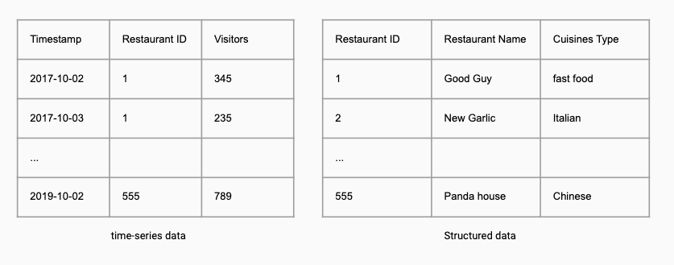
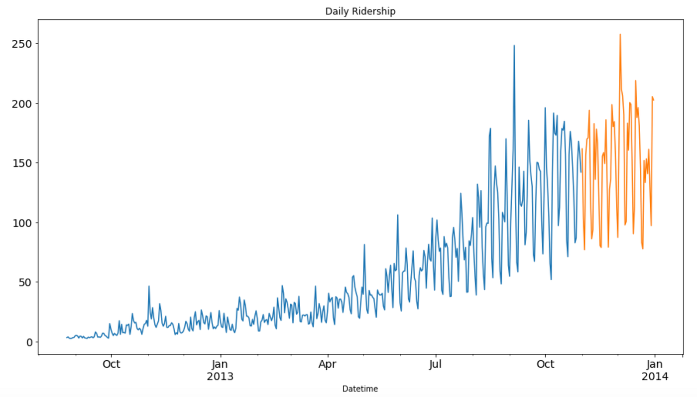
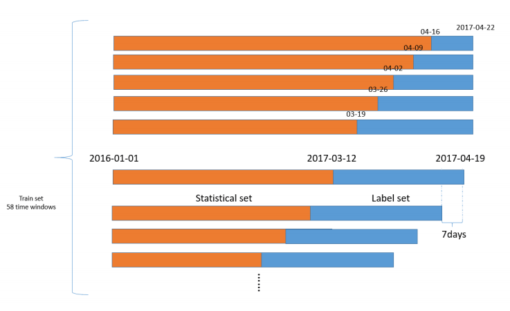

*Originally published on [Medium](https://dxiaochuan.medium.com/combining-time-series-and-tabular-data-for-prediction-9815a5a17cd).*

Time series forecasting is a well-studied statistics/ machine learning branch and a common statistical task in business. In the real world, time-series data sometimes need to be combined with other data sources to construct more powerful machine learning models.

In this article, I would like to summarize common ways to combine time-series data and tabular data to complete a machine learning project.

## 1. Problem analysis

Before diving into methods, let us review the scenarios where we have time-series data and tabular data at the same time.

Time series prediction. We have time-series data for different instances for the same period, and we have metadata for the instances. Our assignment is to predict future time-series based on the given information. For example, [Recruit Restaurant Visitor Forecasting](https://www.kaggle.com/c/recruit-restaurant-visitor-forecasting). In this scenario, we can train an individual model for each instance, but taking them as a whole could be more helpful for models to abstract patterns in all instances.

Instance-based prediction. In this scenario, the assignment is to predict results for instance, and time-series data are provided to generate features for the instances. For example, in the [Home Credit Default Risk](https://www.kaggle.com/c/home-credit-default-risk) Kaggle competition, time-series data of bank transactions are provided to predict credit default risks. This kind of use case can be easily found in the healthcare industry as well. For example, after collecting patients’ time-series data (vital signs, lab results, exam results) and structured data(base information, demography information), we can model on the outcome of clinical procedures and patients’ complication risks.

We have two options to deal with the mentioned problems. We can either merge structured data into time-series data or aggregate time-series data into the structured data.

To be clarified, we do not need to make a one-off decision, actually, sometimes a combination of both solutions could get more accurate and stable results.

## 2. Time-series -> structured data

Let’s start our discussion by merging aggregate time-series data into the structured data.

The nature of the problem is that time-series data tend to narrow and long, while the structured data I mentioned here tend to be wide and short. We need to figure out a way to make the narrow-long format data-series data match with the structured data.

Generally speaking, there are three ways to match data.

- Window-based summary

- Time-series heuristics

- Time-series encoding

- Window-based summary

The window-based summary might be the most well-known method for this problem. For each prediction window, we look back at a defined time range as a feature window and then create features from the window.

In the above diagram, the yellow bars are feature windows. In the windows, there are plenty of ways to generate features from naive mean/ std/ medium/quantiles/skewness/counts to exponentially weighted statistics. There are some tools, like the [tsfresh](https://github.com/blue-yonder/tsfresh) can make these processes more automatic and painless, but more often than not domain-specific engineering methods are more effective than brute force feature generation.

It is also worth mentioning that sometime we might use several looking back windows at the same time to capture time-series short term and long term patterns.

- Time-series heuristics

Time-series forecasting is a well-studied area, thus we can leverage long-standing statistical and machine learning models to provide insights for high-level models.

The methods include but not limited to:

- ARIMA

- Exponential smoothing

- facebook Prophet

- TimeNet

- CNN-LSTM

The majority of the aforementioned methods are univariate time-series model, they can be used for each time-series feature, and then merge the low-level models’ prediction into the structured data. In other words, these models are taken as one part of the feature generation.

- Time-series encoding

Actually, this a much broader topic, I am planning to elaborate more on this by another article. The difference between the encoding and heuristics is that encoding facilitates joint training for the target, this is extremely useful if the higher-level model is a neural network. The encoding network can be taken as a trainable feature extractor helps us create meaningful features to predict results. Some common time-series encoding architectures are RNN(LSTM, GRU), [CNN](https://jeddy92.github.io/JEddy92.github.io/ts_seq2seq_conv/), seq2seq (either with or without attention mechanism ).

## 3. Structured data -> Time-series

This option is relatively easy to understand. We can add structured data as new features for time series data. And then, we use multivariate time-series models to find patterns in data.

If the features are categorical, [entity embedding](https://towardsdatascience.com/understanding-entity-embeddings-and-its-application-69e37ae1501d) is very helpful to compress information into a compact version. We can create some features from the time variable as well, such as creating a day of the month, day of the week, year and other components of time as individual features.

The output of this option is related to instances’ id and time (number of predicted rows = #instances * #timestamps). If the requirement is instance-based prediction, we might need another layer to summarize the output. Otherwise, we can take the instance-based prediction as one step forward time-series prediction, and this could ease the modeling process.

## 4. Conclusion

There are many ways to construct a machine learning system to combine time-series data and tabular data. According to my experience and research, there is no universal rule to say which way is better. In practice, in the early stage of a project, a robustness data processing pipeline and stable validation strategy are way more important than a combination strategy, thus using time-series or tabular data alone could be a valid option. In the latter stage, employing model ensembling technology to use different combining methods together may lead to more stable and accurate results. But if we have to consider model interpretability and predicting latency as well, window-based aggregation could be more appropriate.

## Reference:

- Forecasting: Principles and Practice

- The Complete Guide to Time Series Analysis and Forecasting
