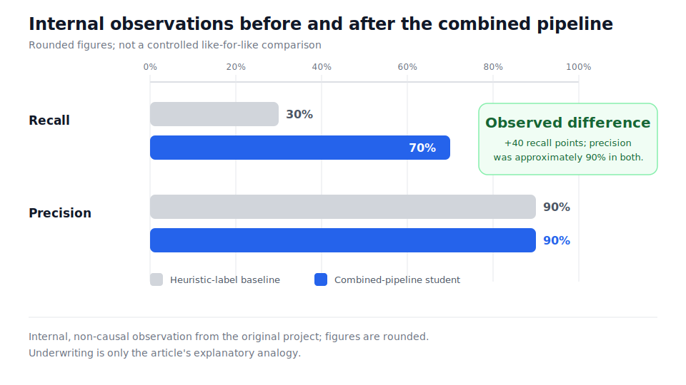
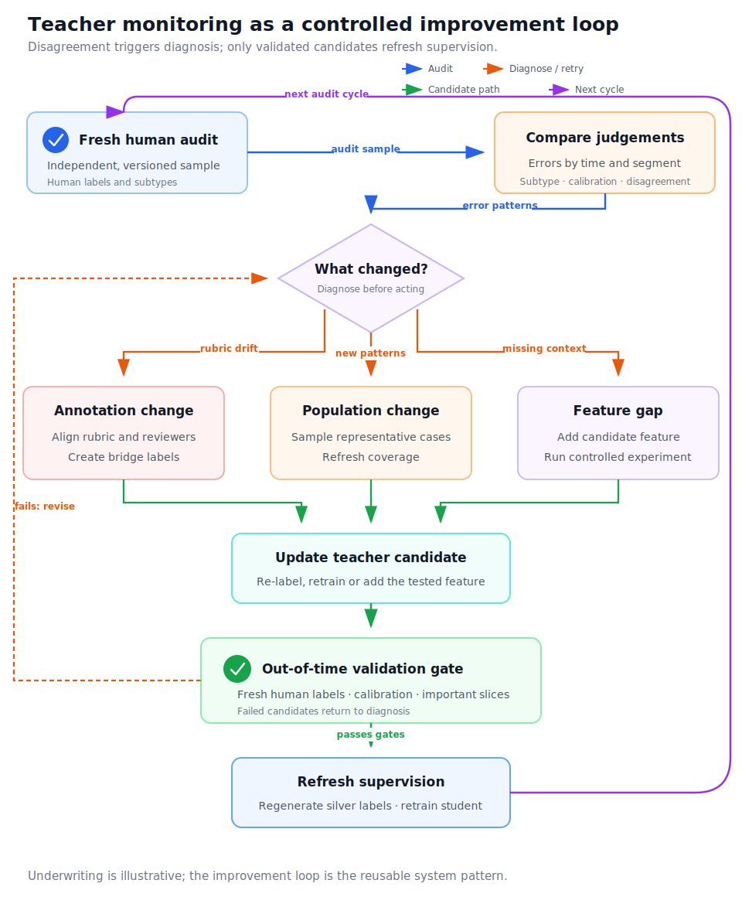

We already had machine-learning models in production when we expanded into a new problem domain. Little human-labelled data existed, so the first models learned from heuristic labels: rules that encoded patterns we understood well enough to write down.

Those models were a practical starting point, not a mistake. But once we had roughly one thousand high-quality human-labelled examples, we could see their limit. Against the human labels, the production baseline had precision around 90% and recall around 30%. When it acted it was usually right, but it missed roughly seven out of ten cases the human labels told us to find.

The new labels contained more information than the production interface could accept. Human reviewers distinguished between levels of severity, while the downstream system expected one binary result. Some of the clearest evidence about a case also arrived after the production decision had been made.

I will use underwriting as an analogy. At application time, a model can use the submitted information and history available then. Two weeks later, the balance, transactions, requested documents and other behaviour may make the historical case easier to judge. That later evidence cannot be used for a new application because it does not exist yet.

> **About the analogy:** Underwriting was not the original domain. The architecture and performance figures come from the original work; the underwriting details are deliberately substituted to protect commercial information.

Translated into that analogy, the richer human taxonomy had three states:

| Human state | Downstream target | Training importance |
|---|---:|---:|
| Approve | 0 | Normal |
| Conditional rejection | 1 | Lower |
| Definitive rejection | 1 | Higher |

Both rejection types mapped to the same production result, but missing a definitive rejection mattered more. The question was: **how could we use richer labels and later evidence to improve a model that would never receive either at decision time?**

## The solution in one minute

We used two models on two clocks.

A **teacher** looked back at mature historical cases. It learned the richer human subtype from the small labelled set and could use both decision-time features and selected post-event features. Once validated, it produced subtype labels for a much larger historical population.

A **student** learned from that expanded dataset using only features available at decision time. It returned the binary value required downstream. During training, definitive rejections received more weight than conditional ones.

The teacher ran as a delayed service for label expansion and monitoring, never in the immediate decision path. Fresh human labels checked its performance and revealed changes in annotation, population or feature coverage.

After we adopted the combined pipeline, observed student recall was roughly 70%, compared with roughly 30% for the baseline, while observed precision was around 90% in both evaluations.

That is an internal observation, not a controlled causal estimate. The figures are rounded, and the original comparison did not isolate the effects of the larger sample, privileged features and severity weighting. I also cannot make a stronger public claim that the evaluations used identical records and threshold-selection procedures. The result should therefore not be read as a reproducible, like-for-like benchmark.

The most useful description is not one long new name. It is a combination of **privileged-feature distillation**, **teacher pseudo-labelling** and **cost-sensitive learning**.

## How the system worked

### Use hindsight without leaking it into production

The student operated at decision time and received only features that genuinely existed then. The teacher operated after the observation window closed, when post-event evidence had matured.

A fourteen-day transaction count would be leakage if it entered the deployed student. Restricting it to a delayed teacher is different: hindsight improves supervision for historical cases, while a separate model makes the live decision without future information.

The human labels trained and evaluated the teacher. The teacher then expanded supervision across mature history, and the student learned from a larger teacher-labelled (“silver”) dataset. Refreshed human labels were essential because a drifting teacher could silently degrade that expanded supervision.

### Preserve rich supervision behind a binary interface

The student still solved binary classification. For target \(y_i\), prediction \(p_i\) and example weight \(w_i\), the implemented idea can be represented by weighted binary cross-entropy:

\[
\mathcal{L}
= \sum_i w_i\left[-y_i\log p_i-(1-y_i)\log(1-p_i)\right].
\]

The important distinction inside \(w_i\) was severity. Definitive rejections received more weight than conditional rejections, while approved examples kept a normal nonzero weight. The serving contract remained binary, but training did not pretend every positive example carried the same consequence.

This choice was also a policy decision. A team should be able to explain why one error costs more than another and check how that preference affects important groups. Weighting should not be tuned merely to produce an attractive precision-recall result.

Severity and label certainty are also easy to conflate. A definitive rejection may be severe but uncertain; a conditional rejection may be mild but clearly labelled. The original weighting captured the business importance of the subtype, not a complete theory of annotation or teacher confidence. That distinction matters when deciding what to improve next.

## How the design connects to research

Training with information unavailable to the deployed predictor is called **learning using privileged information** (LUPI). [Vapnik and Izmailov](https://www.jmlr.org/papers/v16/vapnik15b.html) described mechanisms for transferring that information, and [Lopez-Paz and colleagues](https://arxiv.org/abs/1511.03643) connected LUPI with knowledge distillation. Their semi-supervised extension allows a teacher to supervise examples without human labels.

The closest formulation I found is [Toward Understanding Privileged Features Distillation in Learning-to-Rank](https://proceedings.neurips.cc/paper_files/paper/2022/file/aa31dc84098add7dd2ffdd20646f2043-Paper-Conference.pdf). It defines regular features \(x\), privileged features \(z\), a teacher \(g(x,z)\) and a deployable student \(f(x)\). In simplified form, its student objective mixes gold-label loss with teacher-matching loss:

\[
\mathcal{L}_{\text{student}}
= \alpha \sum_{i\in G}\ell\!\left(y_i,f(x_i)\right)
{}+ (1-\alpha)
  \sum_{i\in G\cup S}
  \ell\!\left(g(x_i,z_i),f(x_i)\right).
\]

Here, \(G\) is the human-labelled gold set and \(S\) is the silver or transfer set. The paper did not include my per-example severity weight in this equation; that was an implementation-specific addition.

The paper also showed that the best teacher does not necessarily produce the best student. As privileged features became more predictive, student performance first improved and then declined. The authors analyse increased variance as one explanation. My operational intuition is complementary: a teacher can also rely on privileged structure that the student cannot recover from ordinary features. Either way, teacher metrics alone do not prove transfer. The student and suitable ablations have to establish it.

[Privileged Features Distillation at Taobao Recommendations](https://arxiv.org/abs/1907.05171) provides a production precedent. Its teacher used post-click behaviour unavailable at ranking time, while the deployed student used serving-time features only. The architecture matches the same information asymmetry, although our teacher also expanded a small human-labelled set into a larger silver population.

Taobao reported improvements in online click and conversion metrics, which makes it a useful precedent for the serving pattern rather than evidence for our particular lift. The domains, targets and evaluation designs differ. The connection is architectural: post-event information can shape a teacher without entering the deployed student's feature set.

Severity weighting belongs to **cost-sensitive learning** rather than privileged distillation. It asks which mistakes matter more. Severity, source reliability and teacher confidence are different concepts, even if an implementation eventually combines them in one loss.

## Where the approach can fail

The design can scale mistakes as efficiently as it scales supervision. A small seed set may encode systematic labelling choices that become thousands of silver labels. Aggregate teacher precision and recall can also hide weak performance on rare subtypes, time periods or population segments.

The teacher therefore needs an independent, continuously refreshed human audit—not its training set—and the student needs an untouched out-of-time evaluation. Feature reconstruction must respect the original decision timestamp. Without those controls, leakage and teacher overconfidence can look like progress.

Coverage matters as much as aggregate accuracy. A teacher can appear healthy while failing on a rare subtype, a new segment or cases far from the original gold sample. Those slices are precisely where label expansion is most dangerous: a small systematic error can be repeated across a large silver population.

The recall lift was plausible only if two conditions held:

1. the expanded population contained useful variation in decision-time features; and
2. the teacher produced structure predictable from those features.

More examples would not help if they only duplicated the original narrow patterns. Nor would a highly accurate teacher whose decisions depended entirely on unknowable future events.

> **If applying this to underwriting:** Outcomes are often observed only for approved applicants, creating a [reject-inference problem](https://arxiv.org/abs/1904.11376). Post-decision behaviour may also be a post-treatment variable, and missing transactions after rejection may be structural rather than zero. Privileged distillation does not remove that selection bias; it may simply learn the historical approval policy. This limitation belongs to the underwriting analogy and did not necessarily exist in the original domain.

## What I would change today

The reported result came from a simpler system than the one I would now build:

| Built then | I would add now |
|---|---|
| Teacher-generated subtype labels | Soft targets calibrated on held-out human labels, plus teacher uncertainty |
| Larger silver training population | Cross-fitting and confidence-aware abstention |
| Severity-weighted binary student | Separate probability, severity and policy layers |
| Human monitoring of the teacher | Versioned audits and controlled change gates |
| Combined performance comparison | Ablations and untouched out-of-time evaluation |

### Separate probability from severity and confidence

I would preserve the teacher's subtype distribution rather than immediately thresholding it. For example:

\[
q_i(\text{reject})
= q_i(\text{conditional}) + q_i(\text{definitive}).
\]

After calibration and validation on independent human labels, that sum can serve as a rejection-probability target. Severity costs should be handled separately—in an auxiliary objective, sample weighting whose calibration effects are understood, or the policy that maps estimates to actions. A weighted binary head generally produces a cost-sensitive score, not the original rejection probability.

For gold examples, I would generate out-of-fold teacher predictions so that each case is scored by a teacher that did not train on it. For silver examples, an ensemble of cross-fitted or bootstrapped teachers could expose disagreement. Low-confidence or out-of-distribution cases should be abstained from or sent for human review rather than forced into a hard pseudo-label.

I would also record provenance, severity cost and teacher confidence separately. For hard teacher labels, one possible decomposition is:

\[
w_i
= w_{\text{source},i}
\,w_{\text{severity},i}
\,w_{\text{confidence},i}.
\]

Keeping these concepts separate makes weak segment results diagnosable. Otherwise noise, business policy and underrepresented subtypes all look like “the weight was wrong.”

### Prove where the lift came from

The minimum useful ablation sequence would compare:

| Experiment | What it isolates |
|---|---|
| Gold labels only | Supervised baseline |
| Regular-feature teacher | Benefit of more pseudo-labels |
| Privileged teacher | Additional benefit of hindsight |
| Severity weighting removed | Contribution of cost-sensitive training |
| Soft or confidence-weighted targets | Sensitivity to teacher uncertainty |

The regular-feature teacher is the easily missed control. Without it, a gain attributed to future features may simply come from giving the student more examples.

All final metrics should come from independent human or matured labels never used to train, tune, calibrate or select either model. I would split by time, wait for every observation window to close, report confidence intervals and inspect important subtypes and segments. This follows the broader lesson in [When the ruler moves](): a model score also measures the surrounding labels, population and evaluation pipeline.

### Make monitoring a controlled improvement loop

Teacher-human disagreement should trigger diagnosis, not automatic feature addition. The useful distinctions are:

- **Annotation change:** reviewers or the rubric changed the intended label.
- **Population change:** new case patterns appeared while the intended label stayed stable.
- **Feature gap:** the intended judgement stayed stable, but the teacher lacked explanatory information.

Each calls for a different response: rubric alignment and bridge labels, representative new sampling, or a controlled feature experiment. Only a candidate that passes out-of-time validation should refresh silver labels and retrain the student.

The audit programme needs two sampling strategies. A random sample gives an unbiased view of performance; targeted labels from uncertain cases, teacher-student disagreements and poorly covered segments are more useful for improvement. Mixing the two without marking their purpose would bias the health metrics.

I would also version the annotation rubric, reviewer guidance, feature definitions, teacher model and silver-label batch together. A movement in agreement could then be investigated as a change in the supervised system rather than immediately blamed on model drift.

The durable lesson is to treat the teacher, annotation process and student as one supervised system with two clocks. Training can use hindsight without pretending hindsight exists in production. Rich judgement can survive a binary serving interface. But expanded supervision still needs an independent human reference, and every teacher improvement must transfer to features the student can actually see.
