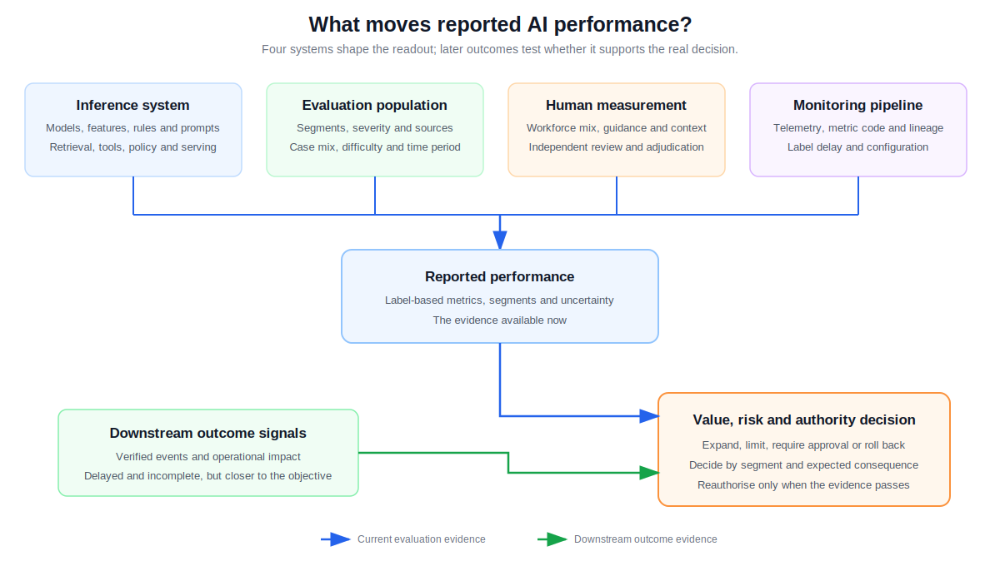
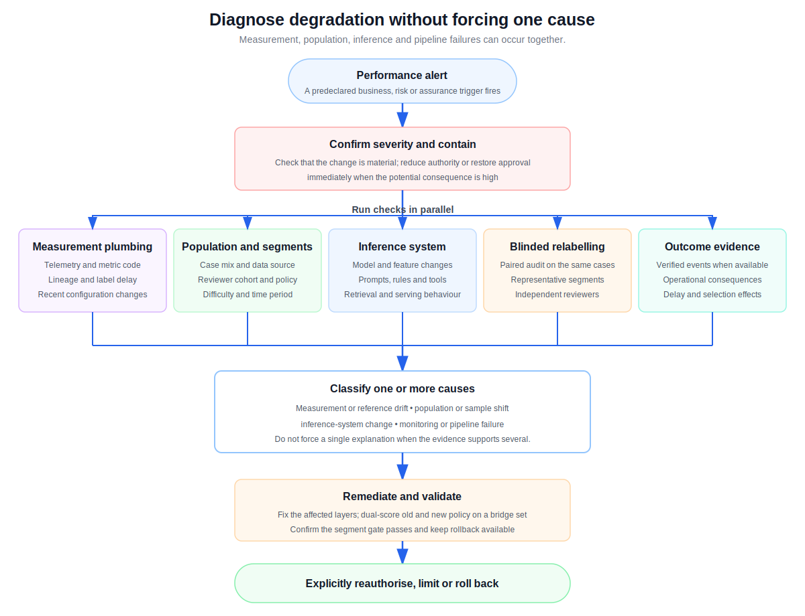

I once worked on a hybrid risk system that combined classical machine-learning models with newer AI components to detect abusive behaviour. For a long time, it worked as expected. Then its measured precision began to decline, slowly enough to look like ordinary noise at first and persistently enough that we eventually had to treat it as a real problem.

The direction of the change was surprising. From our operational experience, new or changing abuse patterns usually hurt recall first: the system misses behaviour it has not learned to recognise. Falling precision means something different. More of the cases flagged by the system are being judged as false positives.

We checked releases, features and data pipelines. Nothing explained the gradual movement. The useful clue came when we broke the evaluation down by case type and reviewer cohort.

Our model team was far removed from the labelling operation inside a large enterprise. That separation was intentional. Reviewers should provide independent judgements without knowing what the model predicted or what the model team hoped to see. While we were investigating, we learned that the labelling provider had onboarded a new group of outsourced reviewers. The model team had not been told, nor should we have been involved in their individual decisions.

The new reviewers were still learning the task boundaries. Experienced reviewers had built up a shared understanding through repeated calibration. Once we analysed results by reviewer tenure and case segment, the workforce change emerged as a material contributor to the measured precision decline. It may not have been the only cause, but it had been hidden inside the aggregate score.

The effect was much stronger in some parts of the data. We had two subtypes of the "bad" class. Large, obvious cases produced almost unanimous decisions. Smaller cases sat close to the boundary and required more judgement.

The figures below illustrate the pattern without reproducing the project's data.

| Segment | Illustrative human agreement | What the result told us |
|---|---:|---|
| Large-scale bad | Around 98% | The rule was reproducible on clear cases |
| Small-scale bad | Around 70% | The boundary, context or calibration needed investigation |
| Good | Relatively stable | False-positive measurement still needed segment-level review |

A change in case mix or reviewer tenure could move the headline precision even when the underlying system changed very little. We thought we were measuring the model. We were also measuring the workforce, the task definition and the sample selected that week.

That experience changed the question I ask whenever an AI metric moves:

> Did the inference system change, did the population change, did the measurement system change, or did the monitoring pipeline change?

## What was actually moving?

A reported performance score is produced by comparing system outputs with reference labels on a sample of cases. The score is then used to support a business or operating decision. Each link in that chain can move.

The inference system includes more than a model binary. Features, rules, prompts, retrieval sources, tools, policies, configuration and serving behaviour can all change its outputs. The population can shift toward different segments or difficulty levels. Human reference labels can move with reviewer composition, guidance or context. Metric code, telemetry and delayed labels can also distort the readout.

Agreement metrics help us inspect one part of this system. Raw agreement tells us how often people selected the same answer. Statistics such as Krippendorff's alpha adjust for agreement expected by chance and can support several reviewers or missing ratings. [Artstein and Poesio](https://aclanthology.org/J08-4004/) explain the assumptions behind common measures.

Agreement is not accuracy. Everyone can consistently apply the same mistaken rule. Low agreement is not automatically careless work either. It may expose unclear guidance, insufficient context, overlapping categories or a case with more than one defensible interpretation.

The [ChaosNLI dataset](https://aclanthology.org/2020.emnlp-main.734/) makes this visible. It collected 100 judgements for each example and found substantial disagreement in widely used benchmark data. Models performed well on examples where people strongly agreed and struggled on low-agreement examples. The disagreement carried information about difficulty.

## Why every applied AI team should care

This problem is not specific to risk models or forward-deployed engineering teams. Any applied ML or AI team can use an evaluation to decide whether a feature is ready, whether a workflow can be automated, or whether a human must remain in the loop.

Suppose a system appears to beat a human baseline. That finding may support more authority for the system. If the baseline came from unstable labels, the decision rests on unstable evidence. Human review might be removed too early.

The opposite failure is possible. Noisy evaluation can make a capable system look unreliable, leaving a costly manual process in place. Poor labels also create contradictory fine-tuning examples and false regression alerts.

Test-set errors can even reverse model comparisons. A study of ten widely used datasets estimated that at least 3.3% of test labels were wrong on average and found that corrected labels could materially change model rankings ([Northcutt, Athalye and Mueller, 2021](https://datasets-benchmarks-proceedings.neurips.cc/paper/2021/hash/f2217062e9a397a1dca429e7d70bc6ca-Abstract-round1.html)).

Authority should increase in stages instead of making one leap from manual work to full automation. A system can begin in shadow mode, then recommend, act only after approval, act with retrospective review, and finally act autonomously within defined limits. Promotion should happen by segment. It should depend on the cost and reversibility of errors, available controls, model evidence, confidence in the evaluation and verified outcomes. Human agreement by itself cannot authorise automation.

## Building a stable ruler

When evaluation can change an important operating decision, casual review is not enough. I would borrow several protections from randomised clinical trials: define the protocol in advance, randomise assignment and blind people to information that could influence their judgement. The analogy is imperfect, but the bias controls are useful. The [CONSORT 2025 statement](https://www.bmj.com/content/389/bmj-2024-081123) shows how carefully clinical research documents study design and analysis.

The protocol begins with the label. Each category needs an operational definition, inclusion and exclusion rules, enough context, boundary examples and an option to abstain when evidence is insufficient.

Cases should be randomly assigned within important strata such as segment, severity, source and time period. Presentation order should also be random. If specialist knowledge is required, assignment can be randomised within an expertise tier.

Initial decisions must remain independent. Reviewers should not see the system output or another person's answer. Adjudicators should be blind to the system version. Where practical, they should also be blind to the original reviewer's identity, tenure and provider.

Independence does not require organisational blindness. Anonymised cohort, tenure, provider, guideline version and timestamps can be attached after a judgement is submitted. Those fields let an evaluation owner detect calibration drift without allowing the model team to coach individual decisions.

Blinded repeat cases measure whether a person reaches the same decision later. Hidden, rotating reference cases help detect calibration drift. Examples need to be refreshed so the exercise does not become a memory test. The final acceptance set should remain untouched; a separate rotating audit set can support ongoing monitoring without repeatedly tuning to the same cases.

## Compare the system with a workforce, not an imaginary human

"Human-level" sounds precise, but it is incomplete. A new reviewer, a calibrated specialist and an adjudicated panel will produce different results. The relevant comparator is usually the workforce process the system may assist or replace.

I would draw the human baseline as a distribution. Report the median and spread across calibrated reviewers, a strong individual result and the performance of an adjudicated panel. Avoid choosing one unusually good or unusually weak person to stand for everyone.

Humans and the system should receive the same randomly sampled cases, evidence, rubric and response options. Time limits and tools should be comparable where feasible, and any remaining asymmetry should be documented. When a person is scored against group consensus, that person's own vote should be removed from the reference. Otherwise the score receives a built-in advantage.

Compare performance on paired cases and report confidence intervals. Precision and recall should appear by segment, together with calibration, abstention, latency and the expected cost of errors where those measures matter. A single accuracy number is rarely enough for an imbalanced or high-consequence task.

Human-human agreement remains useful, but it is not a ceiling. A model can learn shared signal across many noisy judgements and outperform a typical individual. Simulations by [Richie, Grover and Tsui](https://aclanthology.org/2022.bionlp-1.26/) show why pairwise agreement should not be presented as the maximum model score.

When disagreement reflects real ambiguity, preserve the vote distribution. Work on [CIFAR-10H](https://openaccess.thecvf.com/content_ICCV_2019/html/Peterson_Human_Uncertainty_Makes_Classification_More_Robust_ICCV_2019_paper.html) found that training with human label distributions improved robustness and generalisation compared with hard-label controls.

## Labels are fast; outcomes are closer to the real decision

Human labels arrive quickly enough to train a model and monitor recent behaviour. They remain measurements made under a policy. Both the system and the reviewers can share the same blind spot.

Later evidence can provide another view. Confirmed customer reports, verified operational events or realised loss may tell us whether the decision matched what eventually happened. These outcome signals can expose errors that agreement alone cannot find.

They are not perfect ground truth. Outcomes may arrive weeks later, appear only for cases that received follow-up, or be changed by the intervention itself. A prevented event cannot always be observed as an event that would have happened. For that reason, outcome signals should triangulate human labels and adjudication, not automatically replace them.

The practical result is a two-speed measurement system. Labels provide a fast leading indicator. Delayed outcomes audit whether that indicator remains connected to the real-world objective.

## The labelling system is also a people system

When disagreement appears, blaming a reviewer is tempting and usually unhelpful. I prefer to begin with the conditions around the decision.

Was the definition clear? Did the person have enough context? Did the interface encourage the wrong selection? Was the boundary covered in training? Had the policy changed informally? Was the workload reasonable?

This is a blameless approach because the first goal is to understand and improve the system. It does not remove personal responsibility. Reviewers are expected to apply the rubric carefully, use abstention when evidence is missing, explain difficult decisions and participate in calibration. Repeated careless behaviour still needs to be managed after process problems have been addressed.

Newer reviewers deserve particular care. Lower tenure may explain weaker calibration, but it is not proof of lower ability. New people often expose assumptions that experienced staff learned informally. If only long-tenured staff can apply the rule consistently, the written rule may be incomplete.

There is a political dimension too. People may believe evaluation will be used to replace their jobs. Even without deliberate manipulation, that fear can make the process more conservative and reduce willingness to share tacit knowledge. Explain how labels will be used, keep model evaluation separate from individual performance management where possible, and involve experienced operators in defining failure modes and escalation rules.

Keep the raw labels. An adjudicated answer is a new record, not permission to erase disagreement. [Datasheets for Datasets](https://arxiv.org/abs/1803.09010) provides a useful structure for recording how a dataset was made, what it contains and where its limits lie.

## A dashboard that leads to a decision

Most teams already have too many metrics. The dashboard should separate business outcomes, operating coverage, risk gates and measurement assurance.

| Role | Metric | Definition and period | Breach action and owner |
|---|---|---|---|
| Business outcome | Risk-adjusted net value | Monthly benefit minus system, review, monitoring and expected error costs | Freeze expansion and review the business case; accountable product executive |
| Operating metric | Verified autonomous coverage | Share of eligible cases handled without pre-action review while segment gates pass | Reduce the affected segment's authority; accountable operating owner |
| Risk gate | Critical-segment performance | Predeclared precision, recall or expected loss with a confidence bound and minimum sample | Restore approval or pause the segment; accountable model-risk owner |
| Assurance control | Evaluation stability | Paired score change on a periodic blinded audit using the same cases | Investigate the ruler before changing the system; accountable evaluation owner |

Each organisation will choose its own thresholds, but the threshold must exist before the result arrives. Every metric needs a denominator, reporting period, minimum sample, alert condition, one accountable owner and a defined response. Shared awareness is useful; shared accountability usually means nobody owns the decision.

Below this top layer, diagnostic metrics can show raw agreement, Krippendorff's alpha, class prevalence, reviewer-pair confusion, abstention, adjudication rate, repeat consistency, label delay and results by cohort. Monitor prompt, retrieval, tool, configuration, feature and serving changes alongside the model version.

Verified autonomous coverage should always be read beside risk. Coverage can rise simply because the system acts on more cases. That is progress only if expected harm remains within the agreed tolerance and outcome evidence supports the decision.

## When the number falls

A performance drop should begin a controlled investigation, not an argument about whether the system or the reviewers are at fault. Several causes can happen at the same time.

First, confirm the size and severity of the change. If the potential harm is high, reduce authority or restore human approval immediately. Diagnosis can continue while the safer operating mode is in place.

Then check the measurement plumbing: telemetry, metric code, data lineage, label delay and recent configuration changes. Localise the signal by segment, data source, reviewer cohort and policy version. Run a paired blinded relabelling audit on a representative sample and inspect whatever downstream outcomes are available.

The result may point to measurement drift, population shift, an inference-system change, a pipeline failure or a mixture of them. Fixes should follow the evidence. The goal is not to assign one convenient cause.

If the labelling policy changes, preserve both histories. Score a historical bridge set under the old and new policies so the team can distinguish a definition change from a performance change. Do not draw a continuous trend line across two definitions and call it progress.

Return to service should be a decision, not the automatic end of an investigation. Validate the fix, confirm the affected segment meets its predeclared gate, inspect outcome evidence when available, and have the accountable owner explicitly restore authority. Keep rollback available if the signal returns.

NIST's [AI Risk Management Framework](https://airc.nist.gov/airmf-resources/airmf/5-sec-core/) treats measurement and risk management as ongoing work across the AI lifecycle. That matches my experience. A trustworthy evaluation has to be maintained.

## What I would do differently now

I would design the labelling and monitoring plan at the same time as the model evaluation. I would define important segments before looking at the score. I would randomise assignments, blind reviewers to system output, preserve individual votes and build both a rotating audit set and an untouched acceptance set.

I would also collect anonymised workforce metadata after each independent judgement and connect fast label metrics with slower outcome signals.

Most of all, I would return to the question from the beginning: did the inference system change, did the population change, did the measurement system change, or did the monitoring pipeline change?

It can stop a team from tuning a model to fix a measurement problem. It can also stop an organisation from increasing system authority before the evidence is strong enough.
